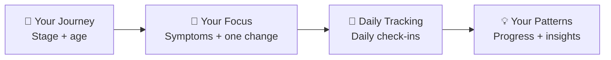

# Vitality Flow

<p align="center">
  
</p>

### One change at a time. A clearer view of your journey.

Vitality Flow is a wellness tracking app designed to help women navigate perimenopause and menopause by better understanding their symptoms and patterns over time.

> Built during the Elevate Women Global Hackathon 2026.

---

## About Vitality Flow

Changes in sleep, energy, mood, memory, and other symptoms can be difficult to understand when they happen gradually or at different times.

Vitality Flow gives women a simple way to track what they are experiencing, focus on one lifestyle change at a time, and observe how their selected symptoms evolve.

Rather than relying only on memory, users can build a clearer record of their own experience, reflect on possible patterns, and use that information to support more informed conversations with healthcare professionals.

Vitality Flow is designed for self-tracking and educational purposes. It does not provide medical diagnosis or treatment.

---

## How It Works



### 1. Understand your starting point

During onboarding, users select:

- their current journey stage;
- their age range;
- up to three symptoms they want to track;
- one main symptom as their primary focus.

### 2. Choose one change

Instead of trying to change everything at once, Vitality Flow encourages users to focus on **one lifestyle change at a time**.

Current categories include:

- supplements;
- physical activity;
- meditation;
- hydration;
- sleep routine;
- dietary changes.

Depending on the selected category, users can add more specific information about the change they want to observe.

### 3. Check in

Users record how they are feeling through simple daily check-ins focused on the symptoms they selected during onboarding.

### 4. See progress and possible patterns

Vitality Flow brings check-in data together through progress visualisations and insights, helping users notice possible patterns in their own records over time.

These insights describe changes in the user's recorded information. They are not intended to establish medical conclusions or prove that a lifestyle change caused a particular outcome.

### 5. Support better conversations

The insights are designed to help users reflect on what they have recorded, remember changes over time, and prepare for more informed conversations with healthcare professionals.

---

## Current MVP

The current prototype supports the core Vitality Flow journey:

**Onboarding → Choose symptoms → Select a main focus → Choose one lifestyle change → Daily check-ins → View progress → Explore insights**

The MVP currently includes:

- guided onboarding;
- symptom selection and prioritisation;
- one-change-at-a-time tracking;
- daily symptom check-ins;
- progress and trend visualisation;
- educational, non-diagnostic insights.

A Summary entry point is included in the prototype, while the full generated report remains part of the designed experience and is not yet implemented.

> **Note:** Vitality Flow is an MVP developed during a hackathon. Some functionality and interface elements may continue to evolve.

---

## Product Experience

<p align="center">
  
  
  
  
</p>

---

## Designed Experience

The broader Vitality Flow experience includes a Summary Report designed to bring tracked symptoms, lifestyle changes, progress, and observed patterns together in one place.

The report experience has been designed in Figma but is not yet fully implemented in the current MVP.

<p align="center">
  
</p>

---

## Responsible Design

Vitality Flow deals with information that can be personal and sensitive, so responsible data use is an important part of the product's development.

The current MVP is designed around local, on-device storage and does not require users to create an account for the onboarding flow.

The product is intended for wellness tracking and education — not diagnosis, treatment, or medical decision-making.

Any patterns or trends shown by Vitality Flow reflect information recorded by the user and should not be interpreted as proof of causation or as medical advice.

---

## Future Vision

Vitality Flow's longer-term vision goes beyond individual tracking.

Future development could explore:

- richer longitudinal symptom and lifestyle tracking;
- user-controlled ways to share summaries with healthcare professionals;
- community and comparison experiences that help women explore experiences and patterns shared by others;
- optional ways for users to contribute appropriately protected data to support women's health research and education.

These are **roadmap concepts and are not implemented features of the current MVP**.

Any future functionality involving data contribution, sharing, research, or community features would require appropriate privacy, consent, security, and data-governance safeguards.

---

## Built With

### Core Technology

- React 19
- TypeScript
- TanStack Start
- TanStack Router
- TanStack Query
- Vite
- Tailwind CSS
- Radix UI
- Recharts
- React Hook Form
- Zod

### Design & Development Workflow

- Lovable
- Figma
- GitHub
- Claude
- ChatGPT

---

## Getting Started

### Prerequisites

To run Vitality Flow locally, you will need:

- Node.js
- npm
- Git

### Run Locally

Clone the repository:

```bash
git clone https://github.com/Huth-P/vitality-flow-splash.git
```

Enter the project directory:

```bash
cd vitality-flow-splash
```

Install the dependencies:

```bash
npm install
```

Start the development server:

```bash
npm run dev
```

Then open the local URL displayed in your terminal.

### Build for Production

```bash
npm run build
```

### Preview the Production Build

```bash
npm run preview
```

---

## Demo

🎥 **Video Demo:** Coming soon

🌐 **Live Prototype:** Coming soon

---

## Team

Built collaboratively during the **Elevate Women Global Hackathon 2026** by:

- [Pamela Huth](https://github.com/Huth-P)
- [Karina](https://github.com/Karinasvela)
- [Nnenna](https://github.com/NnennaMazi)
- [Julieta](https://github.com/julietameschiniluppi)

---

## Hackathon

Vitality Flow was created as an MVP for the **Elevate Women Global Hackathon 2026**.

The project explores how thoughtful self-tracking can help women make their own experiences easier to observe, remember, and communicate.

---

## Disclaimer

Vitality Flow is a wellness and educational tool and is not a medical device.

It does not diagnose, treat, prevent, or cure any medical condition and is not a substitute for professional medical advice, diagnosis, or treatment.
